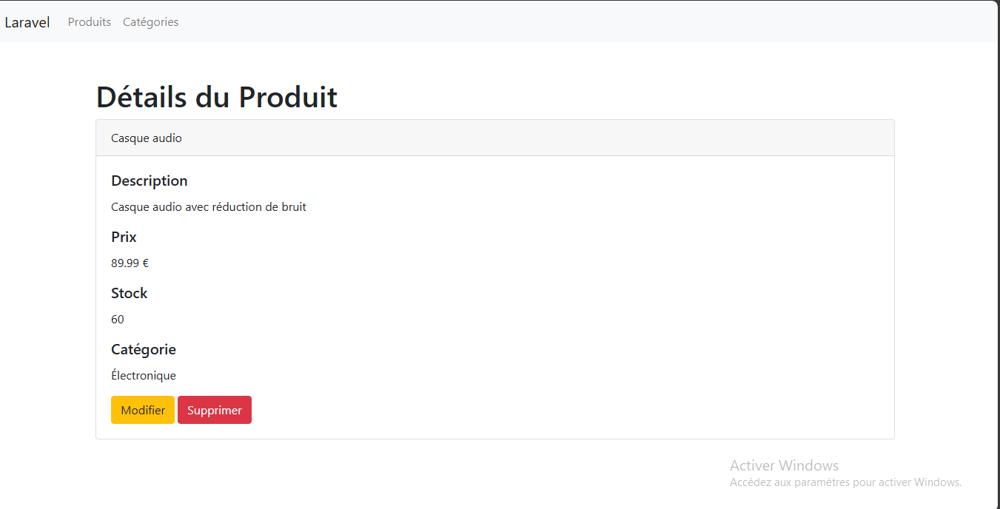
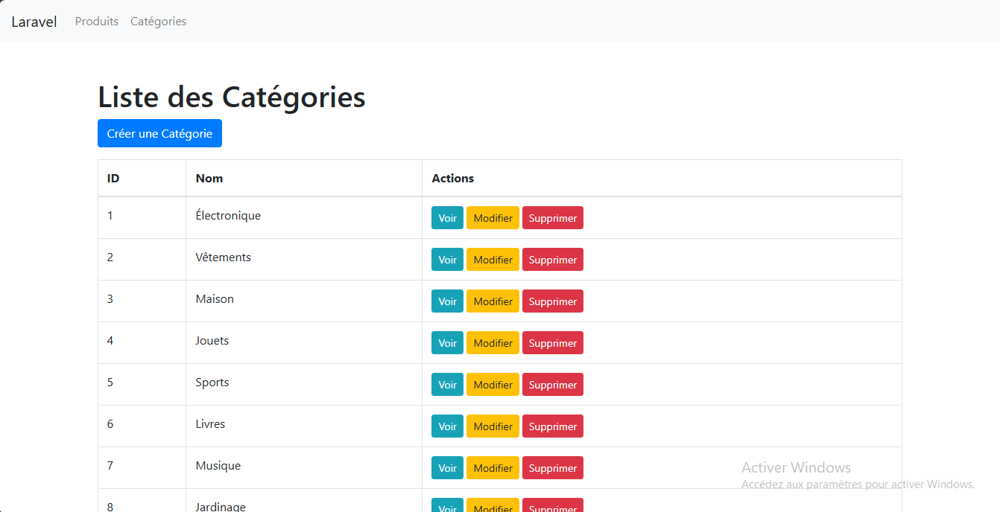

Titre du projet: Gestion de produits e-commerce

## Description

Ce projet est une application de back-office pour un site e-commerce, développée avec Laravel. Il permet de gérer les produits, les catégories, les stocks, et d'effectuer diverses opérations administratives nécessaires pour le bon fonctionnement du site.

## Fonctionnalités

- **Gestion des Produits :**
  - Ajouter, modifier et supprimer des produits.
  - Visualiser les détails des produits.
  - Gestion des stocks et des prix.
  
- **Gestion des Catégories :**
  - Créer, modifier et supprimer des catégories de produits.
  
- **Gestion des Stocks :**
  - Suivre et mettre à jour les quantités en stock des produits.
  
- **Interface d'Administration :**
  - Recherche et filtrage des produits et catégories.

# Interface

Voici les captures d'écrans :

